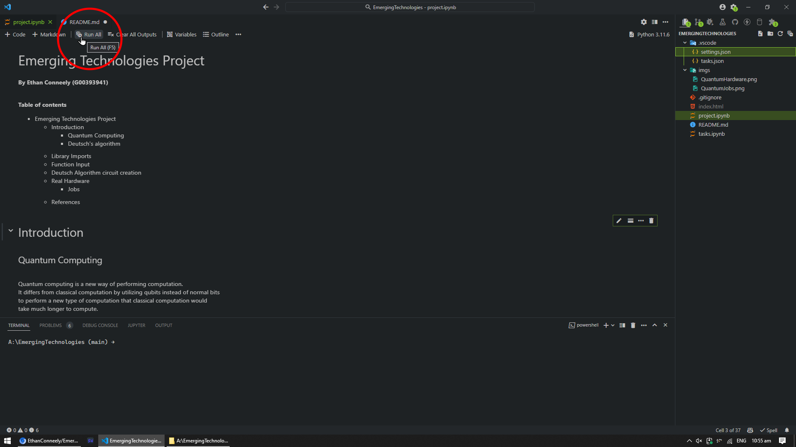

# EmergingTechnologies

Emerging Technologies Project and tasks

This repo contains the tasks and project for the module Emerging Technologies for 4th year Software Development in ATU.

## How to run the tasks and project

Install git
Install Jupyter notebook extension for vscode

Install `Python 3` or higher  
Install `Jupyter Notebook`  
Install `matplotlib` and `qiskit`

or

Install `Anaconda`

Clone down the repo

```shell
git clone https://github.com/EthanConneely/EmergingTechnologies.git
cd EmergingTechnologies
code .
```

Before you can run it you will need to setup your ibm quantum account.

[Ibm account setup Tutorial](https://docs.quantum.ibm.com/start/setup-channel#ibm-quantum-platform)

Once everything is installed and you have the vscode extension installed
You can press the run button to run the project you will need to.


